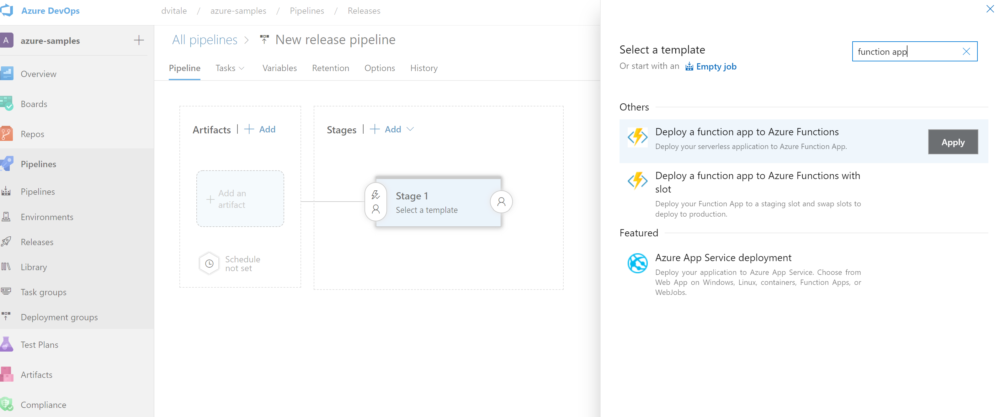

# How to deploy an Azure Function using Azure

This is a basic example on how to handle the CI/CD deployment of an Azure Function using Azure Devops

## The goal 

We are going to build a very useless API 

## Prerequisites

1) [Azure Cloud Subscription](https://docs.microsoft.com/en-us/azure/cloud-adoption-framework/ready/azure-best-practices/initial-subscriptions)
2) [Azure DevOps account](https://azure.microsoft.com/en-us/services/devops/?nav=min)
3) [Python](https://www.python.org/downloads/)
4) [Visual Studio Code](https://code.visualstudio.com/Download)
5) [Azure Tools Visual Studio Code Extension](https://marketplace.visualstudio.com/items?itemName=ms-vscode.vscode-node-azure-pack)


## Step 1: Import the repo

The first step is to import this repository into your Azure Devops project. 
To do so you should go to the **Repos** section, clickon the repository list and then on **Import repository**


The you should insert in the *Clone url* the link to this repository `https://github.com/vitaled/azure.git`   


After the import you should clone this repo locally from your Azure devops account. The fastest way to do that is to click on  **Clone in VS code**


```bash
git clone https://github.com/vitaled/azure.git
```

Then you can open this folder using Visual Studio Code

## Step 2: Deploy the Azure Function

In the next step we are going to manualy deploy the Azure Function in your Azure Subscription.

To da that you should right click on the `AzureFunctionDeploymentUsingAzureDevops` subfolder and then click on **Deploy to Function App...**


You will be asked to select a subscription: 


Then click in **Create new Function App in Azure...**


You will be asked to provide a unique name for your function

 

Select **Python 3.9** as runtime stack

 

Select your preferred region (usually the closer to your physical location)


The Function will be created and the useless API uploaded.
In the output log you will see the url of function you just created


Clicking on the url your favourite browser will automatically open and you will connect to the API. You should see an output like this:


# Step 3: Creating a Continuous Integration Pipeline

Our next step will be to create a pipeline that will automatically buiild and create an artifact of our function every time we do a change in the code.

Connect to your Azure Devops project and go to the **Pipelines** section, then click on *Pipelines* -> *Create Pipeline*


A new page will show-up asking to select a repository, when in this page click on *Use the classic Editor*


In the new page pick the *Azure Repos Git* Option and select the repo where you imported your code


Then you will be asked to select a template, search for and select Azure Functions for Python


The template for the building pipeline will be generated. You will be asked to provide an Agent Specification, please select *ubuntu-18-04* from the dropdown list


Click on the pipeline step *Install Application Dependencies* and Set **AzureFunctionDeploymentUsingAzureDevops** as *Working Directory*


Click on the pipeline step *Archive files* and Set **AzureFunctionDeploymentUsingAzureDevops** as *Root folder or file to archive*


Then click on Triggers and select the checkbox *Enable continuous Integration* this will activate the build every time you will push code on the master branch


Click on Save & Queue. This will save your pipeline definition and will trigger the first run.

# Step 4: Create a Continuous Delivery Release process

The result of the previous pipeline is an artifact that contains the code we want to deploy. 
In this step we are going to build a *release pipeline* that will push our code to our Function in the cloud.

Connect to your Azure Devops project and go to the **Pipelines** section, then click on *Releases* -> *New pipeline*


In the next page search and select the templeate *Deploy a function app to Azure Functions*



Then click on the Stage 1 and configure the *Deploy Azure Function App* with the info about the your subscriptio, select Funcion **App on Linux** as *App Type* and your deployed Function Name as *App Service Name*


In the previous page, click on pre stage step and click on *Add an artifact, select **Build** and select the previosly created build pipeline as *Source (Build Pipeline)*


On the created step click on small icon on the top right to configure the trigger and enable the continuous deployment trigger. This will trigger a new release everytime a new build is created


