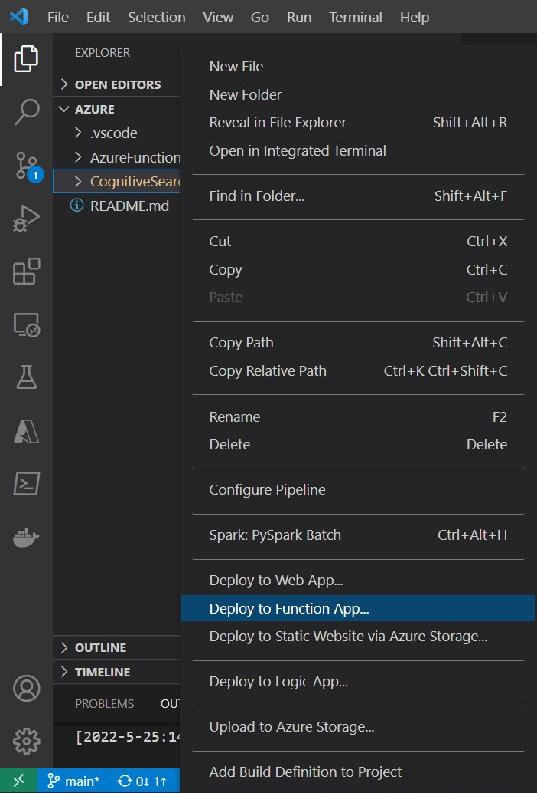
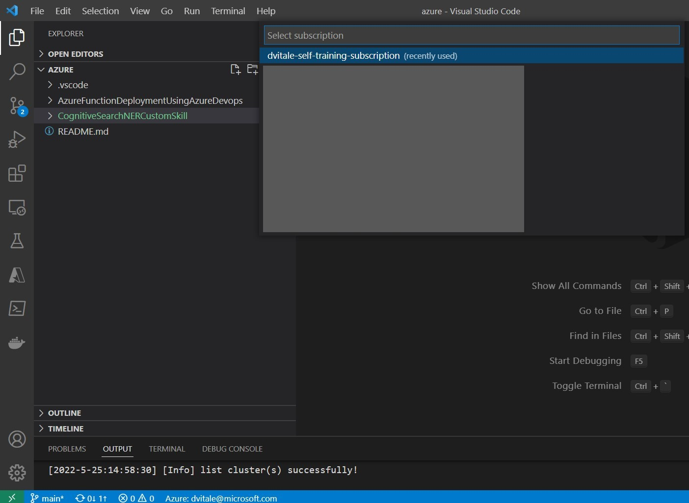
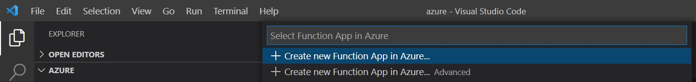
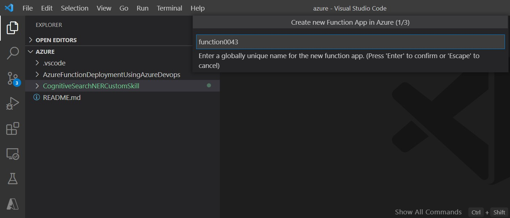
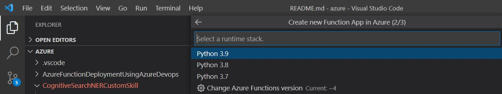
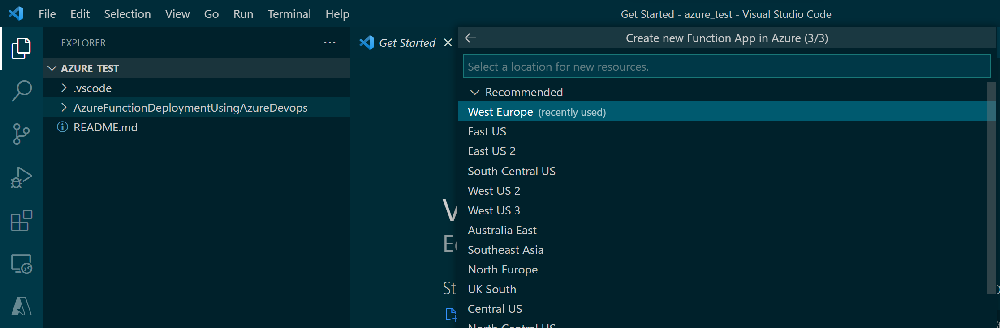
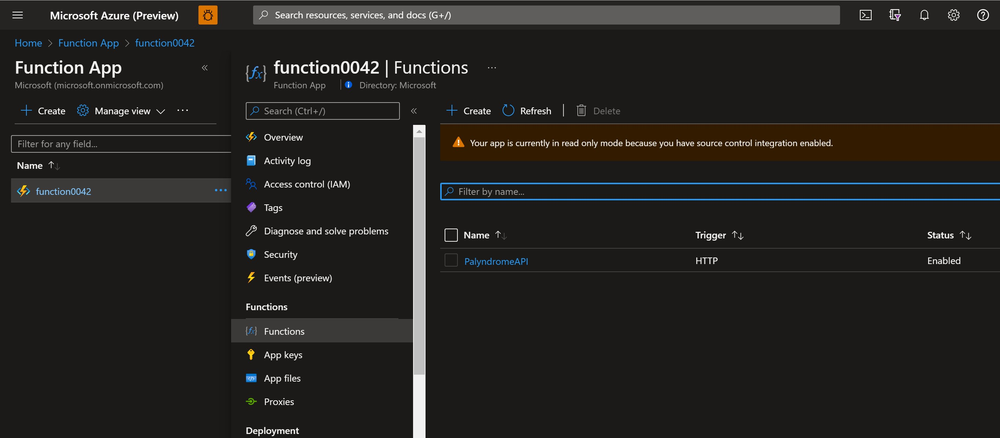

# How to create a basic Custom Skill for Azure Cognitive Search

This is a basic example that explains how to create a very simple custom skill in Azure Cognitive Search
by using an Azure Function as a backend

# The goal

We are going to create a very simple (and mostly useless) custom skill extracting all the palindromic words from a text

## Prerequisites

1) [Azure Cloud Subscription](https://docs.microsoft.com/en-us/azure/cloud-adoption-framework/ready/azure-best-practices/initial-subscriptions)
2) [Azure Cognitive Search service](https://docs.microsoft.com/en-us/azure/search/search-create-service-portal)
3) [Storage account service](https://docs.microsoft.com/en-us/azure/storage/common/storage-account-create?tabs=azure-portal)
4) [Python](https://www.python.org/downloads/)
5) [Visual Studio Code](https://code.visualstudio.com/Download)
6) [Azure Tools Visual Studio Code Extension](https://marketplace.visualstudio.com/items?itemName=ms-vscode.vscode-node-azure-pack)

   
### Step 1 

## Step 1: Clone the repo

The first step is to clone this repository into your local envinronment. 

```bash
git clone https://github.com/vitaled/azure.git
```

Then you can open this folder using Visual Studio Code

## Step 2: Deploy the Azure Function

In the next step, we are going to manually deploy the Azure Function in your Azure Subscription.

To do that you should right-click on the `CognitiveSearchNERCustomSkill` subfolder and then click on **Deploy to Function App...**



You will be asked to select a subscription: 



Then click on **Create new Function App in Azure...**



You will be asked to provide a unique name for your function

 

Select **Python 3.9** as runtime stack

 

Select your preferred region (usually the closer to your physical location)



The Function will be created and the useless uploaded.

After the creation, go to the function page in the Azure Portal and click on  `Functions` -> `PalyndromeAPI`



Then click on `Get Function Url` and copy the URL that we are going to use in the step (4)

## Step 3: Upload sample Data

Create a container called `books` in your storage account and upload into it the file available in the sample folder.

## Step 4: Create your search Stack

From a PowerShell terminal run the script init-books-search.ps1

```psh
.\init-books-search.ps1
```
You will be prompted to insert the following information:
```
Selecting subscription <insert subscription id>
Please enter your storage account name: : <insert storage account name>
Please enter your storage account key: : <insert storage account key> 
Please enter your search service name: :  <insert storage account key> 
Please enter your search service key: : <insert service key>
Please enter your Cognitive Service Key: : <insert cognitive service key>
Please enter your Function App URI: : <insert function uri app>
```

## Step 5: Verify your index

Go to the `index` section of your Cognitive Search Service and check that the palindromes are present and are correctly extracted from the text


